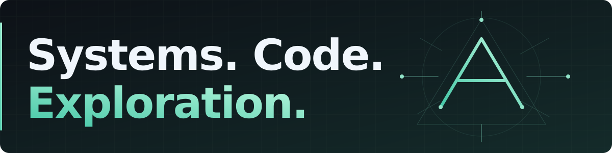
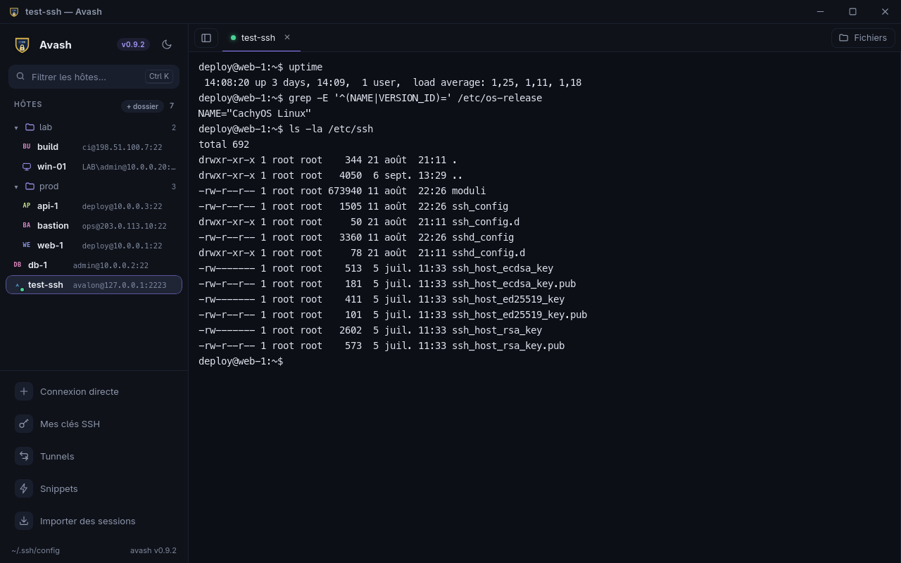

  

[English](README.en.md)

# Bonjour, moi c'est Adrien.

**Je construis des outils pour simplifier l'administration Linux et les connexions distantes.**

Administrateur systèmes derrière **Avalon Network**, je pars des besoins du terrain pour
développer, tester et documenter. J'explore aussi l'auto-hébergement, les agents IA et la simulation.

## Avash — les connexions distantes, réunies

Terminaux **SSH**, bureaux **RDP / VNC** et transferts **SFTP** dans une application de bureau
en **Rust et Tauri**, qui reprend votre configuration OpenSSH.

[**Découvrir**](https://adrienavalon.github.io/avash/) · [**Télécharger**](https://github.com/AdrienAvalon/avash/releases/latest) · [Code](https://github.com/AdrienAvalon/avash) · [Voir la démo](https://github.com/AdrienAvalon/avash#avash)

## Côté Linux

[**SysAdmin-Tools**](https://github.com/AdrienAvalon/SysAdmin-Tools) — Du Bash pour le diagnostic
système, avec un contrôle de santé **SLES 12 SP5 en lecture seule**, documenté et validé avec ShellCheck.

## Explorations

- [**Destructible FPS**](https://github.com/AdrienAvalon/destructible-fps) — Prototype Rust :
  destruction des matériaux, physique et multijoueur à autorité serveur.
  **Le photoréalisme reste un objectif**, pas le rendu actuel. La démo jouable et l'inspecteur
  graphique sont distincts : [état et feuille de route](https://github.com/AdrienAvalon/destructible-fps/blob/main/REPRISE.md).
- [**Avalon Research**](https://github.com/AdrienAvalon/avalon-research) — Travaux exploratoires
  sur les agents IA, la mémoire persistante et les représentations symboliques.
  Documents en français et en anglais, avec liens vers Zenodo.

## Ma boîte à outils

  
  
  
  
  
  

Diagnostics reproductibles, tests et documentation :
[un exemple concret avec Avash](https://github.com/AdrienAvalon/avash/blob/main/docs/qualite.md).

## Échanger

Une idée, un bug ou une contribution ? Rendez-vous dans les **issues et pull requests** du projet.

[**Avalon Network · Me contacter**](https://avalon-network.com) · [Tous mes dépôts](https://github.com/AdrienAvalon?tab=repositories)
